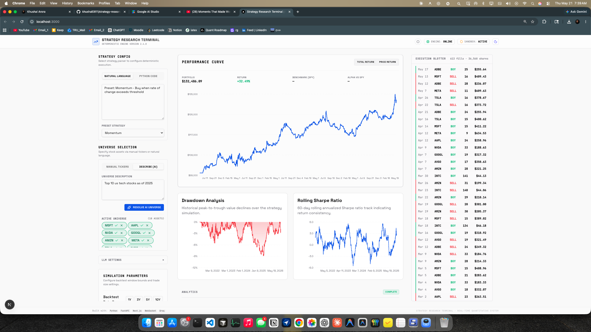
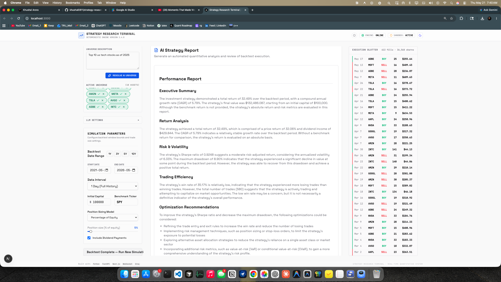
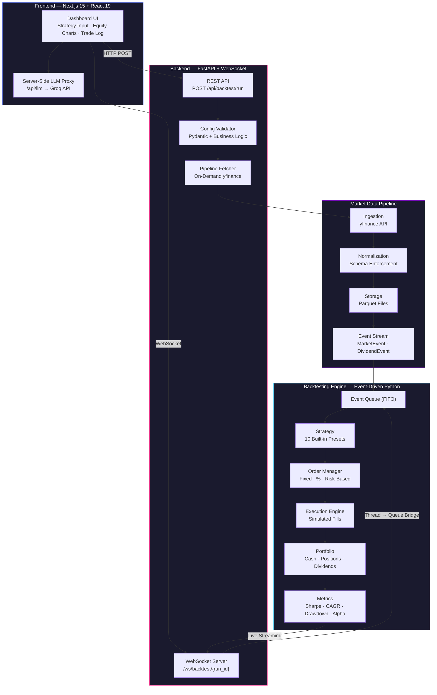
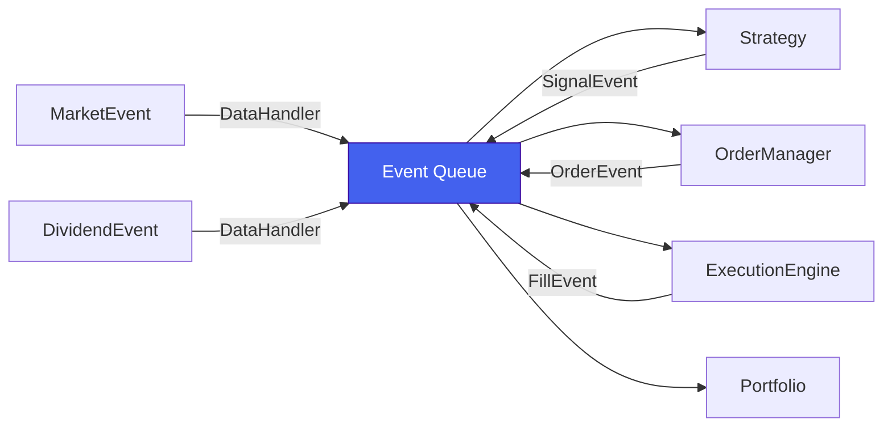

<div align="center">

# Strategy Research Platform

**A full-stack quantitative research system for backtesting trading strategies with real-time streaming, AI-powered analysis, and live performance dashboards.**

[](https://python.org)
[](https://fastapi.tiangolo.com)
[](https://nextjs.org)
[](https://react.dev)
[](#architecture)
[](LICENSE)

[Live Demo](#deployment) · [Architecture](#architecture) · [Features](#features) · [Getting Started](#getting-started) · [Tech Stack](#tech-stack)

<br/>

<table>
<tr>
<td>

</td>
</tr>
<tr>
<td>

</td>
</tr>
</table>

</div>

---

## Overview

Strategy Research Platform is a three-component trading system that lets users configure backtesting strategies through natural language or code, run deterministic event-driven simulations over historical market data, and watch results stream live to a real-time dashboard — complete with equity curves, trade execution logs, and AI-generated performance reports.

> **Built as a portfolio project** to explore event-driven architecture, real-time streaming, quantitative finance, and full-stack system design.

---

## Architecture



### How a Backtest Runs

```
1. User describes strategy → "RSI with 30/70 thresholds on AAPL and MSFT"
2. Groq LLM resolves → { type: "rsi", parameters: { period: 14, oversold: 30, overbought: 70 } }
3. POST /api/backtest/run → validates config, fetches fresh data via yfinance
4. WebSocket connects → engine runs in thread pool, streams progress bar-by-bar
5. Dashboard renders live → equity curve, trade fills, dividend events
6. Engine completes → final metrics + AI-generated performance report
```

---

## Features

<table>
<tr>
<td width="50%">

### 🧠 Natural Language Strategies
Describe a strategy in plain English — the Groq LLM maps it to one of **10 built-in presets** with tuned parameters.

### 📝 Custom Python Strategies
Write strategy code directly in the browser editor for full control.

### 📡 Real-Time Streaming
Equity curve, trade fills, and dividend events stream live via WebSocket — no page refreshes.

### 📊 Performance Analytics
Total return, CAGR, Sharpe ratio, max drawdown, volatility, win rate, and alpha vs benchmark.

</td>
<td width="50%">

### 🤖 AI-Generated Reports
Post-backtest analysis summaries powered by Groq LLM.

### 🔍 Ticker Validation
Real-time yfinance validation with green/red chip feedback when adding tickers.

### 🌗 Dark / Light Mode
Full theme support with system-aware defaults.

### ⚡ Deterministic Engine
Same input always produces identical output — no lookahead bias, no non-determinism.

</td>
</tr>
</table>

---

## Repository Structure

This monorepo contains three interconnected components:

```
strategy-research-platform/
├── Backtester-Oriented-Market-Data-Pipeline/   # Data ingestion & storage
│   ├── market_data/
│   │   ├── api.py                              # High-level data access API
│   │   ├── ingestion.py                        # yfinance fetching
│   │   ├── normalization.py                    # Schema enforcement
│   │   ├── storage.py                          # Parquet read/write
│   │   └── events.py                           # MarketEvent & DividendEvent
│   └── scripts/fetch_data.py                   # CLI data fetcher
│
├── Event-Driven-Backtesting-Engine/            # Strategy simulation
│   ├── engine/
│   │   ├── engine.py                           # Main event loop
│   │   ├── strategy.py                         # 10 strategy implementations
│   │   ├── portfolio.py                        # Position & cash tracking
│   │   ├── execution.py                        # Simulated order fills
│   │   ├── order_manager.py                    # Position sizing (3 modes)
│   │   ├── metrics.py                          # Performance calculations
│   │   └── events.py                           # Event type definitions
│   ├── run_backtest.py                         # CLI & importable runner
│   └── tests/                                  # 126-test suite
│
├── strategy-research-terminal/                 # Full-stack UI
│   ├── backend/
│   │   ├── main.py                             # FastAPI entry point
│   │   ├── api/routes.py                       # REST endpoints
│   │   ├── websocket/manager.py                # Thread→async streaming bridge
│   │   ├── pipeline/fetcher.py                 # On-demand data fetching
│   │   └── validation/config_validator.py      # Business logic validation
│   └── frontend/
│       ├── app/page.tsx                        # Dashboard layout
│       ├── components/                         # Input, Charts, Analytics, Report
│       ├── hooks/                              # useBacktest, useWebSocket
│       ├── llm/                                # Groq LLM resolvers
│       └── store/terminalStore.ts              # Zustand global state
│
├── Dockerfile                                  # Production container
└── render.yaml                                 # Render deployment blueprint
```

---

## Built-In Strategies

| # | Strategy | Key | Signal Logic |
|---|---|---|---|
| 1 | Moving Average Crossover | `moving_average_crossover` | Short MA crosses above/below long MA |
| 2 | RSI | `rsi` | RSI crosses oversold/overbought levels |
| 3 | MACD | `macd` | MACD line crosses signal line |
| 4 | Bollinger Bands | `bollinger_bands` | Price crosses Bollinger bands |
| 5 | Momentum | `momentum` | Rate-of-change exceeds threshold |
| 6 | Mean Reversion | `mean_reversion` | Price deviates from rolling mean |
| 7 | Breakout | `breakout` | Price breaks N-bar high/low |
| 8 | Dual Momentum | `dual_momentum` | ROC exceeds its own rolling average |
| 9 | Trend Following | `trend_following` | Price above/below long-term MA |
| 10 | Volume-Weighted Mean Reversion | `volume_weighted_mean_reversion` | VWAP-based mean reversion |

---

## Tech Stack

| Layer | Technology |
|---|---|
| **Frontend** | Next.js 15, React 19, TypeScript, Tailwind CSS 4, Zustand, Recharts |
| **Backend** | FastAPI, Pydantic, uvicorn, WebSocket + asyncio.Queue thread bridge |
| **Engine** | Pure Python, event-driven architecture, pandas, numpy |
| **Data** | yfinance → Apache Parquet (via pyarrow) |
| **LLM** | Groq API (Llama 3.3 70B) |
| **Deployment** | Docker, Render (backend), Vercel (frontend) |

---

## Getting Started

### Prerequisites

- Python 3.9+
- Node.js 18+

### 1. Clone the repository

```bash
git clone --recurse-submodules https://github.com/khushal0811/strategy-research-platform.git
cd strategy-research-platform
```

### 2. Start the backend

```bash
cd strategy-research-terminal/backend
python -m venv .venv && source .venv/bin/activate
pip install -r requirements.txt

# Configure paths
cat > .env << EOF
DATA_DIR=$(pwd)/../../Backtester-Oriented-Market-Data-Pipeline/data
ENGINE_PATH=$(pwd)/../../Event-Driven-Backtesting-Engine
PIPELINE_PATH=$(pwd)/../../Backtester-Oriented-Market-Data-Pipeline
EOF

# Create data directory
mkdir -p ../../Backtester-Oriented-Market-Data-Pipeline/data

uvicorn main:app --reload --port 8000
```

### 3. Start the frontend

```bash
cd strategy-research-terminal/frontend
npm install

# Configure environment
cat > .env.local << EOF
NEXT_PUBLIC_API_URL=http://127.0.0.1:8000
NEXT_PUBLIC_WS_URL=ws://127.0.0.1:8000
GROQ_API_KEY=your_groq_api_key_here
EOF

npm run dev
```

Open [http://localhost:3000](http://localhost:3000).

### 4. Run the tests

```bash
cd Event-Driven-Backtesting-Engine
pip install -r requirements.txt
pytest tests/ -v    # 126 tests
```

---

## API Reference

| Endpoint | Method | Description |
|---|---|---|
| `/health` | `GET` | Health check |
| `/api/data/info/{symbol}` | `GET` | Symbol data availability + yfinance validation |
| `/api/data/symbols` | `GET` | List all locally available symbols |
| `/api/backtest/run` | `POST` | Validate config, fetch data, register run → returns `run_id` |
| `/ws/backtest/{run_id}` | `WS` | Stream live progress, trades, dividends, final metrics |
| `/api/llm` | `POST` | Server-side Groq LLM proxy |

---

## Deployment

### Backend → Render (Free Tier)

The repository includes a [`render.yaml`](render.yaml) blueprint and [`Dockerfile`](Dockerfile) for one-click deployment.

1. [Fork this repo](https://github.com/khushal0811/strategy-research-platform/fork)
2. Go to [render.com](https://render.com) → **New** → **Blueprint** → connect your fork
3. Render auto-detects `render.yaml` and deploys

### Frontend → Vercel

1. Import `strategy-research-terminal` on [vercel.com](https://vercel.com)
2. Set **Root Directory** to `frontend`
3. Add environment variables:
   - `NEXT_PUBLIC_API_URL` = `https://your-backend.onrender.com`
   - `NEXT_PUBLIC_WS_URL` = `wss://your-backend.onrender.com`
   - `GROQ_API_KEY` = your Groq API key

---

## Event System

The engine processes five event types through a shared FIFO queue:



| Event | Emitted By | Key Fields |
|---|---|---|
| `MarketEvent` | DataHandler | timestamp, symbol, OHLCV |
| `DividendEvent` | DataHandler | timestamp, symbol, amount |
| `SignalEvent` | Strategy | symbol, BUY/SELL, strength |
| `OrderEvent` | OrderManager | symbol, side, quantity |
| `FillEvent` | ExecutionEngine | symbol, side, fill_price |

---

## Performance Metrics

| Metric | Description |
|---|---|
| Total Return | `(final − initial) / initial` |
| CAGR | Compound annual growth rate |
| Sharpe Ratio | Annualized risk-adjusted return (√252) |
| Max Drawdown | Largest peak-to-trough decline |
| Volatility | Annualized std dev of daily returns |
| Win Rate | Fraction of profitable trades |
| Alpha | Return above benchmark (SPY default) |
| Dividend Income | Cumulative dividends credited |

---

## Design Principles

- **Event-Driven** — no vectorized shortcuts; every bar triggers real event flow through a FIFO queue
- **Deterministic** — same input always produces identical output
- **Modular** — swap any component (strategy, execution, sizing) without touching others
- **Real-Time** — WebSocket streaming bridges synchronous engine execution to async frontend via `asyncio.Queue`
- **AI-Augmented** — natural language strategy resolution and post-run analysis via LLM

---

## License

MIT — see [LICENSE](LICENSE).
